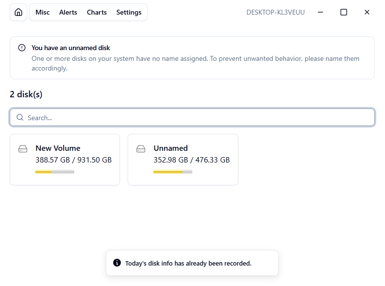
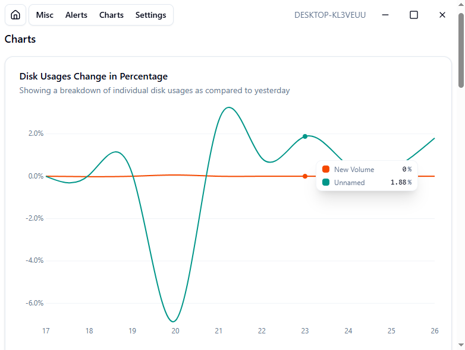

A small desktop app that records and analyzes disk usages over time.

## Motivation

As a developer, downloading tools and building projects are a part and parcel of our daily routine. However, this can have severe repercussions to the disk usage if not monitored closely. One day you will get caught off guard when your disk is full and it is a big hassle to then cleanup from that point. This app was built to be proactive in monitoring the disk usages over time so that unwanted stuffs can be detected and removed immediately.

## Tech

- SvelteKit
- Rust
- Tauri
- SQLite
- shadcn/svelte
- Azure Pipelines CI

## Features

- Disk usage recording
- Disk metadata details
- Graphs for visualization
- Customizable settings
- Internationalization
- Dark & light mode
- Create notification for thresholds

## Design

The app is simple. At it's core, it is meant to launch in the background with the computer startup. The end-user shouldn't be concerned with its execution. It will record the disk state every day (given the computer have logons) as a time-series historical data that can be used for further analysis. It will also notify the user shall there be any threshold alerts enabled by the user.

## Screenshots

Homepage

Example graph showing disk usage changes in percentage

## Learnings

This is the first time I use Rust and Tauri in my project. Working with them are surprisingly pleasant despite not having the penchant for the Rust language due to its complexity (?). I learned how to implement internationalization in SvelteKit without using any libraries with plain TypeScript files.

## Future Development

Here are a few features that I think will be incredible to implement

- Identify largest files
- Identify duplicate files
- Export report as PDF
