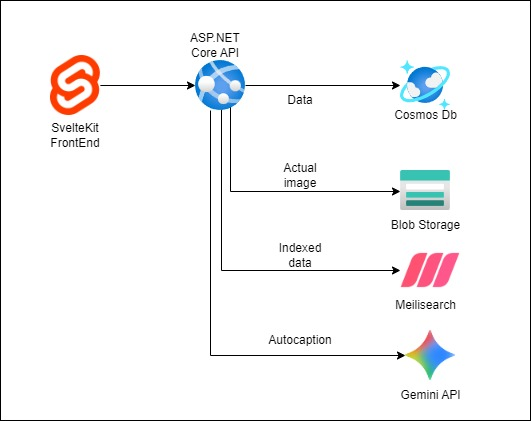
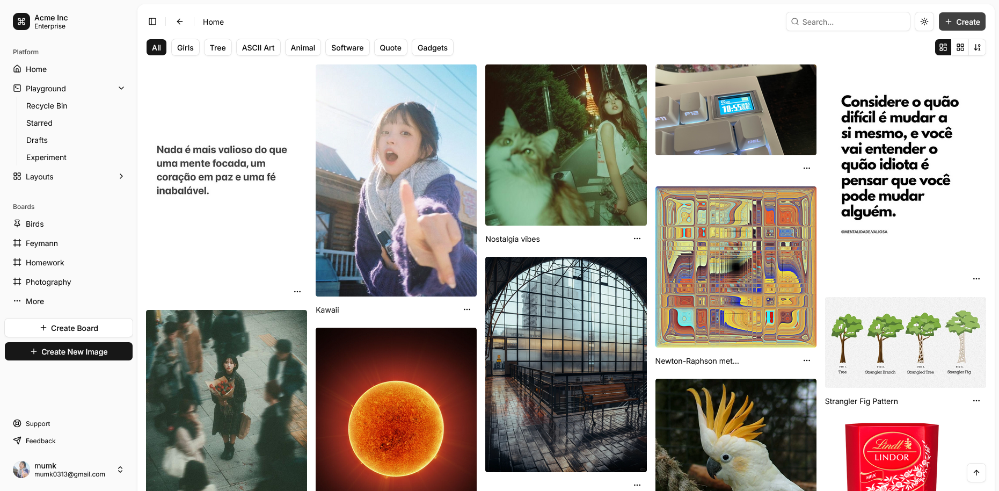

A self-hosted personal image board for organizing images.

## Motivation

I love to take photo using my phone but my phone space is limited. It's iPhone and its a pain in the ass. I am planning to offload the images that I took to my PC (its difficult) so that I have some spare space. I wanted an aesthetically pleasing program to organize the images so that I can reminisce and review with intention.

Additionally, I wanted to organize images I've collected from the internet as they are a great source of inspiration, knowledge and entertainment. Recently I am trying to figure out about my house innovation and I can use it to collect all relevant images from the internet for my own reference. I am also intereted in photography and will keep any eye-catching shots that I want to integrate to my style.

## Tech

- C#
- ASP.NET Core
- SvelteKit
- Docker
- Meilisearch
- Gemini API
- Azure Cosmos DB (Emulator)
- Azure Blob Storage (Emulator)

## Features

- Regular CRUD operations for an image
- Recycle bin for soft deletion
- Boards to organize images
- Semantic search
- AI Caption
- TOTP authentication
- Swagger Page

## Design

## Screenshots

## Learnings

This is my first time using Cosmos DB (Emulator) & Blob Storage (Emulator) in my project. I've learned how to set up abstraction layer for the Cosmos DB entities and queries. I store the image record (metadata) in Cosmos DB, while saving the actual image in the Blob Storage. I use SixLabors.ImageSharp to manipulate the image to have a thumbnail version and a medium version, totalling 3 versions uploaded.

When I tried to implement search, I realised that Cosmos DB don't have the feature built-in, and if brute forcing full-text search would be inefficient. Then idea pops up on my mind to use Meilisearch or Elasticsearch, which able to cater for semantic search. At the end I decided to use Meilisearch for simplicity. It was a pleasure to work with! Then, I have an idea of integrating with AI for generating auto caption and tagging. Fortunately, Gemini have the free-tier API for me to dabble with.

When the MVP is done, I wanted to build and containerize the application and the dependencies so that it can be started with a single `docker-compose up -d` command. Spend quite some time to write the `Dockerfile` for both the API and the web client and thankfully it turned out well. However, another roadblock hit when I tried connect the API to the Cosmos Db Emulator within the Docker network. With the help of GitHub Copilot, it is able to identify the root cause -- Cosmos DB Emulator replying `127.0.0.1` as the base URL for the Azure SDK and it uses that host despite it is not that value in the connection string. It might be behaving that way because it is an emulator meant for local development only. The fix is to introduce HTTP interceptor in the API that redirect the `127.0.0.1` call to the Docker container identifier manually.

## Future Development

Here are a few features that I think will be incredible to implement

- Auditing
- Logging with Loki
- Monitoring with Grafana
- Encryption
- Async processing with RabbitMQ
- Caching with Redis
- Image manipulation & text editing
- Batch upload/download
- Identify similar/same
