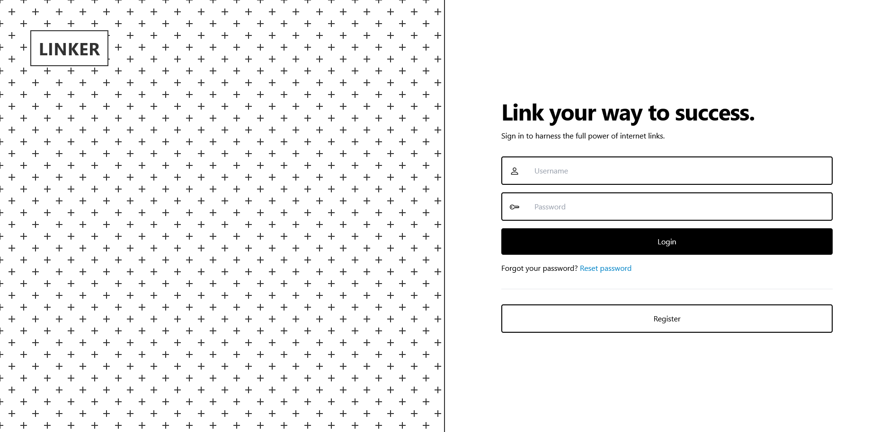
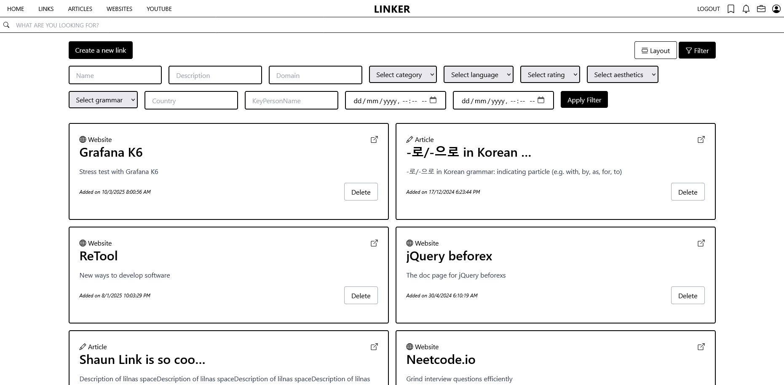
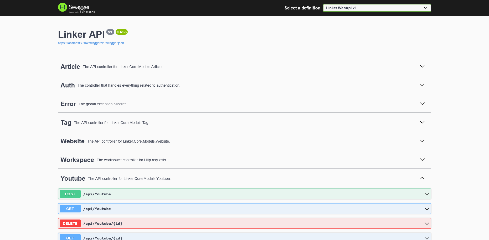

A suite of applications for managing useful URL links for personal reference. Consists of a CLI, WebAPI, MVC frontend and a WebJob.

## Motivation

I personally faced a challenge where there are too many great URL resource for tools, info, knowledge, and entertainment that I cherish, but they all end up in the list of browser bookmark or some random txt files that I will never look at it again.

The secondary goal is to learn how .NET works, hence, asides the core features, it also includes other optional feature such as file uploading and real-time chat.

## Tech

- C#
- ASP.NET Core
- TailwindCSS
- SQLite
- SQL Server
- Entity Framework
- Quartz.NET
- GitHub Actions CI

## Features

- Regular CRUD operations for a link
- Collection/list to group links
- Full text search
- API endpoints
- Swagger Page
- Background jobs to detect dead links and favicon scraping
- Cookie authentication

## Screenshots

### Web Portal

**The login interface**



**The listing page**



### Web API

The Swagger page



### Command-line Interface

```
usage: linker <command> [options]

A CLI application to manage and organize links.

Commands:
  help                              Display this help message.
  add         <url> [options]       Add a new link. Optionally provide details.
  get         <id> [options]        Get a link. Optionally select details.
  show        [options]             Display all stored links.
  update      <id> [options]        Update an existing link's detail.
  delete      <id> [options]        Delete a link by its ID.
  visit       [options]             Open the specified link in the default browser.
  search      <keyword>             Search for links containing the specified keyword.
  list create <listname> [options]  Create a new list to organize links.
  list show   [options]             Display all created lists.
  list update <listid> [options]    Update details of an existing list.
  list add    <listid> <linkid>     Add a link to a specific list.
  list get    <listid> [options]    Gets a list. Optional select details.
  list remove <listid> <linkid>     Remove a link from a specific list.
  list delete <listid> [options]    Delete a list and all links within it.
  export      <filename> [options]  Export all links to a file in the specified format.
  list export <filename> [options]  Export all lists detail or links of a specific list to a file in the specified format.
  list visit  <listid> [options]    Visit links in a list. Options include visiting all links, a random link or the last link.

Options:
  -h, --help               Show help information.
```

## Learnings

This is my first ever large-scale project that I think it's a pretty big stepping stone for me to get my hands dirty with C# and .NET development. I deviated to develop a link sharing social media, and then refocused back on what I truly want -- a offline CLI using SQLite as the backing store. There are a total of 3 version of implementation in this repository. The first is an API with links having separate class (website, article, and YouTube). It became awkwward when I found myself repeating the same logic at 3 different places, even with abstraction and code sharing, and it lead me to think that they should be one entity instead.

I consolidated the entity into link in V2 which I introduced the MVC as the front end. It made me think and reflect about the schema design and how important it is to avoid redesigning in the later stage of the implementation. Also, I made a decision to use SQL Server as the database to learn more about it as well. I stored the snapshot of the database definition as a Database project in .NET Framework, which is something new to me at the time. I introduced workspace, multi-user, realtime chat with SignalR and it gradually becomes a social sharing platform instead. While I had fun developing this, I found myself deviating from what my original needs are -- a tool for personal use.

Thats why I have implemented the CLI version from scratch, trimming the unnecessary features just for my personal offline use. It is my first time self-parsing a CLI interface and using the Entity Framework as ORM. So far, I've been using the CLI nicely, and had over 500+ links in my own storage.

## Future Development

Here are a few features that I think will be incredible to implement

- Add OAuth/OIDC authentication
- Use Grafana for telemetry tracking
- Use Grafana Loki for log sinks
- Integrate with RabbitMQ for asynchronous processing
- GraphQL server to save bandwidth
