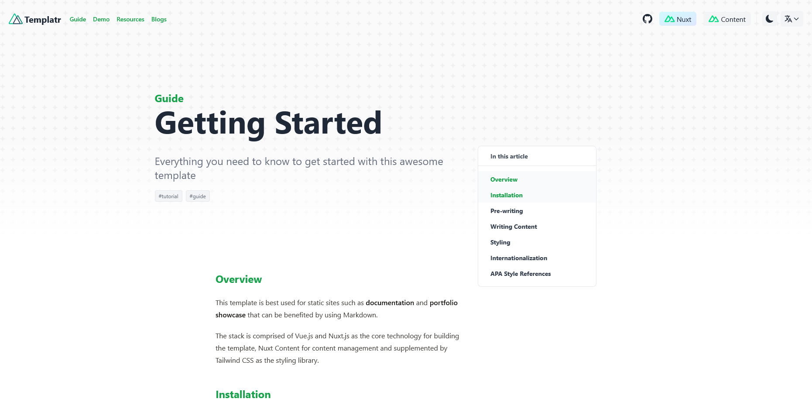
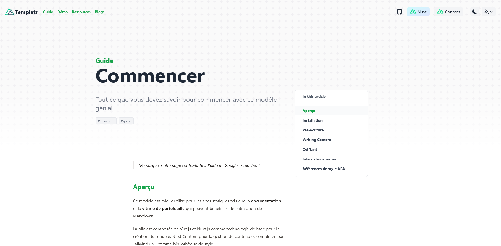

A template for building Markdown oriented websites with Nuxt Content and TailwindCSS. Focus on the writing rather than low-level implementation and configurations.

## Motivation

- Wanted to build out my new personal website
- Want Markdown
- Want newest version of Vue, Nuxt and Nuxt Content (at the time).
- Build this multi-purpose template so I can use for other projects.

## Tech

The technologies and tools used within this project.

- Vue
- Nuxt
- Nuxt Content
- TailwindCSS
- TypeScript

## Features

- Markdown articles
- Markdown embeddable LaTeX (`rehype-mathjax`, `remark-math`)
  - Math Equations
  - [Chemical Equations](https://notes.mumk.dev/articles/general/latex#chemical-equations)
- Internationalization (i18n, `@nuxtjs/i18n`)
- Dark Mode (`@nuxtjs/color-mode`)
- Mobile responsive
- Styling with TailwindCSS
- Static-site generation
- Simple SEO (`nuxt-seo-kit`)
  - Auto-generated Sitemap.xml
  - robots.txt
  - Optimized site metadata
- Image optimization (`@nuxt/image`)
- Vue utilities
  - Powerful hooks (`@vueuse/core`)
  - Animation (`@vueuse/motion`)
- 404 Page
- Ultra-fast loading speed
- Support for Node 18, 20 and 22
- Typo checking (need to install from [crates-ci/typos](https://github.com/crate-ci/typos))
- Sass support

## Screenshots

Example Markdown blog page

Internationalized Markdown blog page with French

## Learnings

Nuxt and Vue's ecosystem are evolving at a rapid pace. Keeping up the versions is a nightmare. I am stuck with the versions I have currently and unable to update because it will break the template. I learned that simplicity has its own value and I will use 11ty or Astro for future Markdown and static site demands.

## Future Development

Here are a few features that I think will be incredible to implement

- PWA support
- Search
- Tag pages
